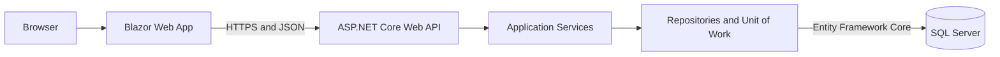

# TuanKiet BranchFlow

[](https://dotnet.microsoft.com/)
[](https://github.com/khangba153/TuanKietBranchFlow/actions/workflows/ci.yml)
[](https://github.com/khangba153/TuanKietBranchFlow)
[](https://branchflow-web-khang153-gphzgbakgdg0dndr.eastasia-01.azurewebsites.net)

TuanKiet BranchFlow is a multi-branch beverage shop operations management system built as an ongoing graduation project.

The project demonstrates a complete application flow from a responsive Blazor interface to an ASP.NET Core Web API, application services, repositories, Entity Framework Core, and SQL Server.

- **Source code:** [github.com/khangba153/TuanKietBranchFlow](https://github.com/khangba153/TuanKietBranchFlow)
- **Live demo:** [TuanKiet BranchFlow on Azure](https://branchflow-web-khang153-gphzgbakgdg0dndr.eastasia-01.azurewebsites.net)
- **API documentation:** `/swagger` is enabled in the Development environment only
- **API health endpoint:** `/health`

> The application is under active development. The public deployment is a demonstration environment, not a production system.

---

## Project Goals

TuanKiet BranchFlow is designed to support common beverage shop workflows, including:

- User authentication and role-based authorization
- Branch-scoped data access
- Employee and assignment management
- Shared menu management with branch-specific availability
- Employee order creation
- Order processing
- Inventory operations
- Payroll and operational reporting

The project is developed incrementally using vertical slices. Each slice goes through the UI, API, business service, repository, database, testing, and deployment layers.

---

## Current Features

### Authentication and Authorization

- JWT-based authentication
- Roles: `OWNER`, `ADMIN`, and `EMPLOYEE`
- Role-based endpoint authorization
- Branch-scoped access control
- Authentication state restoration after refreshing the Blazor application
- Logout and invalid-token handling
- Secrets stored outside the repository

### Employee Management

- View employees by branch in the Web application
- Search employees by name or employee code
- Filter employees by employment status
- View employee profiles
- Create employees from the Web application
- Update employee information, change status, and transfer branches through the API
- Preserve branch-assignment history
- Validate effective dates and employment business rules

### Branch Menu Browsing

- Load the menu for the employee's assigned branch
- Validate active employee assignment before returning menu data
- Display product categories and products
- Display the minimum active product-size price
- Return product sizes, toppings, and quick-note options
- Filter products by category
- Search product names with Vietnamese accent-insensitive matching
- Responsive Bootstrap interface for desktop and mobile
- Handle loading, empty, error, unauthorized, and not-found states

### Employee Ordering

- Configure a product with a required size, optional toppings and quick notes, and item quantity
- Manage a cart and submit it through `POST /api/orders`
- Validate branch availability and option limits; re-read prices from the database on the API
- Generate an order code and save the order, items, toppings, notes, and price/name snapshots in one transaction
- View an employee's own order list and historical order details
- Report an incorrect completed order for review without overwriting the original report
- Use responsive ordering, cart, order-list, and order-detail screens on desktop and mobile

### Testing and CI

- Business-rule unit tests using xUnit and Moq
- Tests for branch access and authorization rules
- Tests that verify repositories are not called after access is denied
- Tests for employee validation rules
- Tests for menu DTO mapping and minimum-price calculation
- GitHub Actions workflow for:
  - NuGet restore
  - Release build
  - Automated tests

### Deployment

- ASP.NET Core API deployed to Azure App Service
- Blazor Web App deployed to Azure App Service
- SQL Server database deployed using Azure SQL Database
- Configuration supplied through environment variables and App Service settings
- Public HTTPS demo tested on desktop, mobile, and multiple browsers

> Deployment is currently performed manually. GitHub Actions provides CI, but automatic Continuous Deployment has not been enabled yet.

---

## Current Focus

The next development slice is administrator menu management: categories, sizes, products and prices, toppings, and quick notes. Menu data and prices are shared across branches; product and topping availability is controlled per branch. This administration workflow is planned, not yet implemented.

---

## Planned Features

The following features are planned and have not been fully implemented:

- Administrator menu CRUD
- Administrator and owner order management
- Employee self-service profile
- Inventory transactions and stock tracking
- Inventory counting
- Payroll management
- Dashboard and operational reporting
- System audit log
- Additional integration and browser tests
- Automated deployment workflow

---

## Architecture

The solution follows a layered monolithic architecture.



### Request Flow

```text
Blazor Component
    -> Web API Service
    -> API Controller
    -> Application Service
    -> Repository / Unit of Work
    -> Entity Framework Core DbContext
    -> SQL Server
    -> DTO
    -> HTTP Response
    -> Blazor UI
```

### Layer Responsibilities

| Project | Responsibility |
|---|---|
| `TuanKietBranchFlow.Api` | Controllers, JWT authentication, authorization, middleware, Swagger, health checks, and dependency injection |
| `TuanKietBranchFlow.Application` | DTOs, service interfaces, application services, validation, and business workflows |
| `TuanKietBranchFlow.Infrastructure` | EF Core models, `DbContext`, repositories, Unit of Work, and database queries |
| `TuanKietBranchFlow.Web` | Blazor pages, components, authentication state, API services, and responsive Bootstrap UI |
| `TuanKietBranchFlow.Tests` | xUnit and Moq tests for business rules and application services |

Controllers are kept thin. Business workflows are handled by Application services, while EF Core queries and persistence are handled by Infrastructure repositories.

---

## Technology Stack

### Backend

- C#
- .NET 10
- ASP.NET Core Web API
- Controller-based REST APIs
- JWT Bearer Authentication
- Dependency Injection
- Problem Details
- Swagger / OpenAPI

### Data Access

- Entity Framework Core
- Database First
- Repository pattern
- Unit of Work pattern
- SQL Server
- Azure SQL Database

### Frontend

- Blazor Web App
- Interactive Server render mode
- Bootstrap
- Bootstrap Icons
- `HttpClient`
- Browser Local Storage

### Testing and Development

- xUnit
- Moq
- Git
- GitHub
- GitHub Actions
- Visual Studio
- Visual Studio Code
- Docker for local SQL Server

### Deployment

- Microsoft Azure
- Azure App Service
- Azure SQL Database
- Azure CLI
- Linux App Service

---

## Solution Structure

```text
TuanKietBranchFlow/
|-- .github/
|   `-- workflows/
|       `-- ci.yml
|
|-- TuanKietBranchFlow.Api/
|   |-- Controllers/
|   |-- Properties/
|   |-- Program.cs
|   `-- appsettings.json
|
|-- TuanKietBranchFlow.Application/
|   |-- DTOs/
|   |-- Interfaces/
|   `-- Services/
|
|-- TuanKietBranchFlow.Infrastructure/
|   |-- Data/
|   |-- Models/
|   |-- Repositories/
|   `-- UnitOfWork/
|
|-- TuanKietBranchFlow.Web/
|   |-- Components/
|   |-- Services/
|   |-- wwwroot/
|   `-- Program.cs
|
|-- TuanKietBranchFlow.Tests/
|
|-- database/
|   |-- BranchFlowDB.sql
|   `-- azure/
|       |-- 001-initial-schema.sql
|       |-- 002-seed-tuan-kiet-menu.sql
|       `-- 003-grant-order-flow-runtime.sql
|
|-- docs/
|   |-- context/
|   `-- prototype-ui/
|
|-- TuanKietBranchFlow.slnx
|-- README.md
`-- .gitignore
```

---

## Database Design

The database supports:

- Users and roles
- Branches
- User-branch assignment history
- Employee profiles
- Categories and products
- Product sizes and prices
- Branch-specific product availability
- Topping groups and toppings
- Branch-specific topping availability
- Quick-note groups and options
- Orders and order-item snapshots
- Inventory, payroll, and audit entities for later development slices

Database schema documentation is available in:

- [`docs/context/database-schema-analysis.md`](docs/context/database-schema-analysis.md)
- [`docs/context/business-requirements-v1.5.md`](docs/context/business-requirements-v1.5.md)

The Azure order-flow permissions are recorded in `database/azure/003-grant-order-flow-runtime.sql`. That script is scoped to the demo database and its existing API database user; it is not a complete database setup script or a grant for every API feature.

---

## Prerequisites

Install the following tools before running the project:

- [.NET SDK 10](https://dotnet.microsoft.com/download)
- SQL Server 2019 or later
- Git
- Optional: Docker for running SQL Server locally

Verify the .NET installation:

```powershell
dotnet --version
```

---

## Getting Started

### 1. Clone the Repository

```powershell
git clone https://github.com/khangba153/TuanKietBranchFlow.git
cd TuanKietBranchFlow
```

### 2. Restore Dependencies

```powershell
dotnet restore .\TuanKietBranchFlow.slnx
dotnet tool restore
```

### 3. Create the Local Database

Connect to SQL Server and execute:

```text
database/BranchFlowDB.sql
```

The optional menu seed script is located at:

```text
database/azure/002-seed-tuan-kiet-menu.sql
```

Review the target database before executing a seed script. Do not run local reset or seed scripts against a production database.

### 4. Configure API Secrets

The repository does not contain database passwords or JWT signing keys.

Set the API connection string:

```powershell
dotnet user-secrets set `
  "ConnectionStrings:BranchFlowDatabase" `
  "<your-connection-string>" `
  --project .\TuanKietBranchFlow.Api\TuanKietBranchFlow.Api.csproj
```

Set the JWT signing key:

```powershell
dotnet user-secrets set `
  "Jwt:Key" `
  "<your-jwt-signing-key>" `
  --project .\TuanKietBranchFlow.Api\TuanKietBranchFlow.Api.csproj
```

Example local connection string:

```text
Server=localhost,1433;Database=BranchFlowDB;User Id=<username>;Password=<password>;TrustServerCertificate=True;
```

Do not copy the example placeholders directly into a public environment.

### 5. Configure the Web API Address

The development configuration is stored in:

```text
TuanKietBranchFlow.Web/appsettings.Development.json
```

Default value:

```json
{
  "ApiSettings": {
    "BaseUrl": "http://localhost:5007/"
  }
}
```

### 6. Run the API

Open a terminal at the repository root:

```powershell
dotnet run --project .\TuanKietBranchFlow.Api\TuanKietBranchFlow.Api.csproj
```

Default development addresses:

- API: `http://localhost:5007`
- Swagger: `http://localhost:5007/swagger`
- Health check: `http://localhost:5007/health`

### 7. Run the Web Application

Open another terminal:

```powershell
dotnet run --project .\TuanKietBranchFlow.Web\TuanKietBranchFlow.Web.csproj
```

Default development address:

- Web: `http://localhost:5032`

---

## Build

Build the complete solution in Release mode:

```powershell
dotnet build .\TuanKietBranchFlow.slnx --configuration Release
```

---

## Automated Tests

Run all automated tests:

```powershell
dotnet test .\TuanKietBranchFlow.slnx --configuration Release
```

The current automated tests focus on Application service business rules. They do not yet provide complete integration, database, or end-to-end browser coverage.

---

## Continuous Integration

The GitHub Actions workflow is located at:

```text
.github/workflows/ci.yml
```

It runs on pushes and pull requests targeting `main`.

The workflow performs:

1. Source checkout
2. .NET 10 SDK setup
3. NuGet restore
4. Release build
5. Automated tests

CI validates that the committed source can be restored, compiled, and tested on an independent Ubuntu runner. A successful CI run does not by itself prove that the complete application or production deployment works correctly.

---

## Security Notes

- Connection strings are not committed to the repository
- JWT signing keys are not committed to the repository
- Local development uses .NET User Secrets
- Azure configuration uses App Service environment settings
- API endpoints use JWT authentication and role authorization
- Branch-specific operations validate the current user's active assignment
- Order prices are recalculated from database values instead of trusting Web request prices

Never commit:

- Database passwords
- JWT signing keys
- Azure credentials
- Publish profiles
- Production connection strings
- Demo administrator passwords

---

## Verification Status

As of 2026-09-25, the following evidence exists:

- Release builds complete successfully
- All 19 current Application service unit tests pass locally
- GitHub Actions restore, build, and test workflow runs successfully
- Menu authorization cases have been tested through Swagger
- Local SQL Server queries have been exercised through the API
- The public Web demo has been manually tested on desktop, mobile, and different browsers
- Public employee smoke tests covered menu browsing, order creation (`201`), order list/detail, and reporting an order for review
- Public API checks returned `401` without a JWT and `403` with an ADMIN JWT for the EMPLOYEE-only order-list endpoint
- The public Web homepage and API `/health` endpoint returned HTTP `200` when this README was updated

Current limitations:

- Automated integration tests are not yet included
- Automated browser tests are not yet committed
- Deployment is still manual
- Cross-employee order ownership has not yet been verified on the public demo with two separate employee accounts
- Database restore and application rollback have not yet been rehearsed
- The demo environment should not be considered a production-ready system

---

## Project Documentation

Additional project documents are available in the `docs` directory:

- [Business requirements](docs/context/business-requirements-v1.5.md)
- [Database analysis](docs/context/database-schema-analysis.md)
- [API endpoint roadmap](docs/context/api-endpoint-roadmap-v0.3.md)
- [UI prototypes](docs/prototype-ui)

---

## Roadmap

The current development order is:

1. Implement administrator menu management
2. Implement administrator and owner order workflows
3. Implement employee self-service profile
4. Implement inventory workflows
5. Implement payroll and reporting
6. Expand automated integration and browser testing
7. Rehearse restore and rollback, then evaluate Continuous Deployment

---

## Author

**Thanh Chi Khang Ba**

- GitHub: [@khangba153](https://github.com/khangba153)
- LinkedIn: [Thanh Chi Khang Ba](https://www.linkedin.com/in/thanh-chi-khang-ba-1871ba434/)

---

## Project Status

This repository is actively maintained as a graduation and learning project.

The goal is not only to complete the user interface, but also to understand and demonstrate the complete software flow:

```text
UI -> API -> Business Rules -> Repository -> Database -> Tests -> Deployment
```
